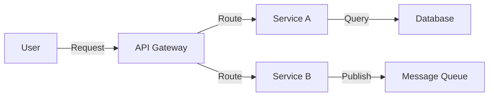
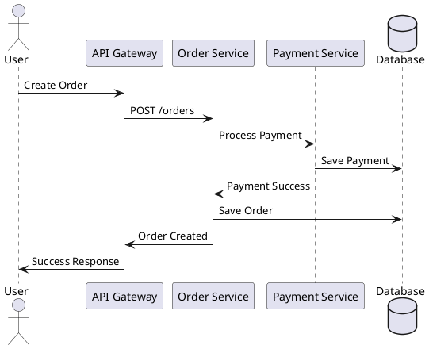
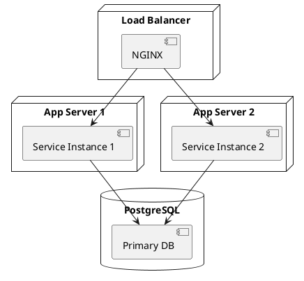
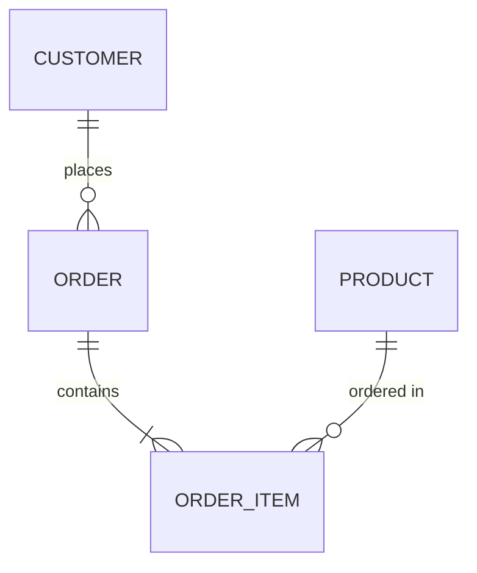

# Visualize Command

Create architecture diagrams using PlantUML, Mermaid, or C4.

## Usage

`/visualize [type] [level]`

## Types

- `c4` - C4 model diagrams
- `flow` - Data flow diagrams
- `sequence` - Sequence diagrams
- `component` - Component diagrams
- `deployment` - Deployment diagrams
- `erd` - Entity Relationship Diagrams

## Levels (for C4)

- `context` - System context (Level 1)
- `container` - Container diagram (Level 2)
- `component` - Component diagram (Level 3)
- `code` - Code diagram (Level 4)

## Implementation

### C4 Diagrams

Generate C4 diagrams using PlantUML format.

#### System Context (Level 1)
```plantuml
@startuml
!include https://raw.githubusercontent.com/plantuml-stdlib/C4-PlantUML/master/C4_Context.puml

Person(user, "User", "End user of the system")
System(system, "Your System", "Description")
System_Ext(external, "External System", "External system")

Rel(user, system, "Uses")
Rel(system, external, "Calls", "HTTPS")
@enduml
```

Analyze codebase to:
1. Identify actors (users, external systems)
2. Identify main system
3. Identify external dependencies
4. Map relationships
5. Generate diagram

#### Container Diagram (Level 2)
Show high-level technology choices and containers.

Analyze:
1. Web applications
2. Mobile applications
3. APIs
4. Databases
5. Message brokers
6. Generate container relationships

#### Component Diagram (Level 3)
Show internal components.

Analyze:
1. Services/modules
2. Controllers
3. Services
4. Repositories
5. Component relationships

#### Code Diagram (Level 4)
Show key classes/interfaces.

### Data Flow Diagrams

Generate Mermaid flowcharts showing:
1. Data sources
2. Processing steps
3. Data transformations
4. Data destinations



### Sequence Diagrams

Generate PlantUML sequence diagrams showing:
1. Actor interactions
2. Service calls
3. Database operations
4. External API calls



### Component Diagrams

Show system components and dependencies:
1. Scan codebase structure
2. Identify components/modules
3. Map dependencies
4. Generate diagram

### Deployment Diagrams

Show deployment architecture:
1. Identify deployment targets (servers, containers, cloud)
2. Map services to infrastructure
3. Show network topology
4. Include load balancers, databases, caches



### Entity Relationship Diagrams

Generate database schema diagrams:
1. Analyze database schema files
2. Identify entities and relationships
3. Map foreign keys
4. Generate ERD



## Output

For each diagram type:
1. Generate diagram code (PlantUML/Mermaid)
2. Save to `/docs/diagrams/` directory
3. Provide rendering instructions
4. Include diagram in architecture documentation
5. Suggest tools for rendering:
   - PlantUML: https://plantuml.com/
   - Mermaid: https://mermaid.js.org/
   - VS Code extensions available
