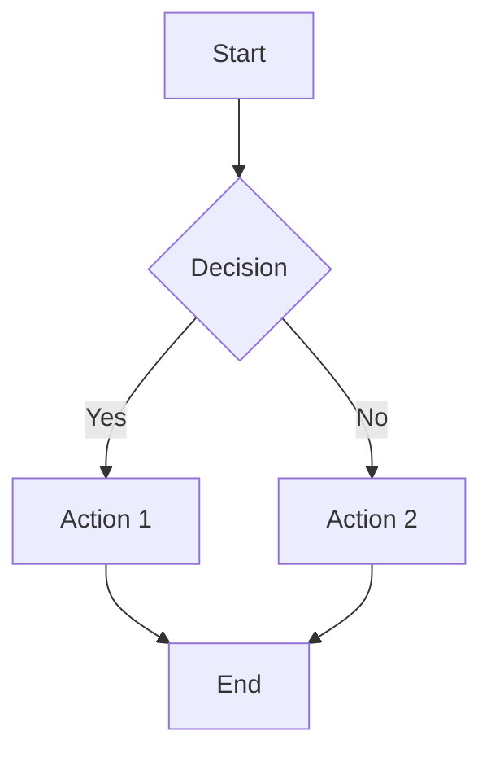
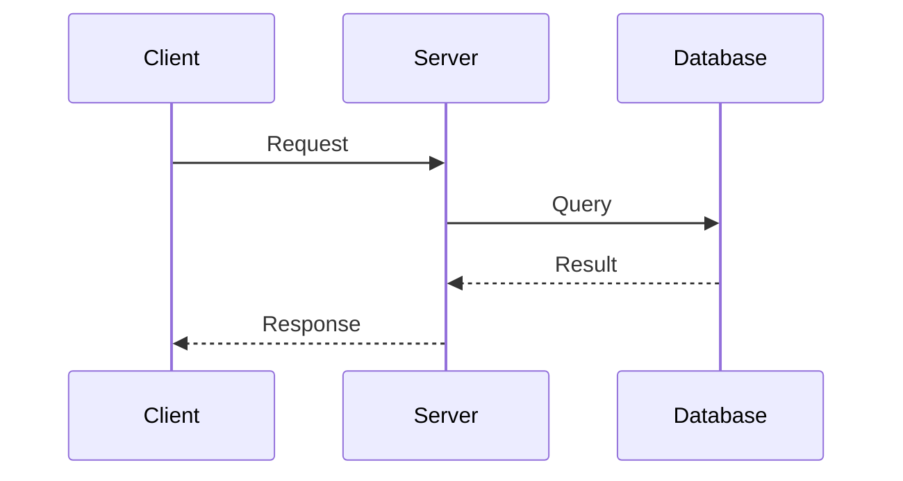
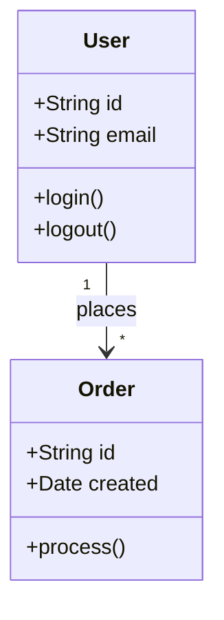
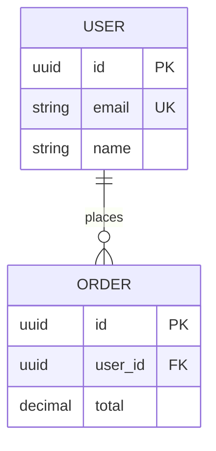
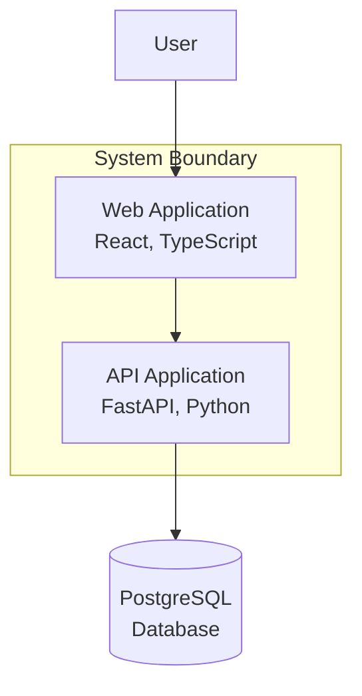
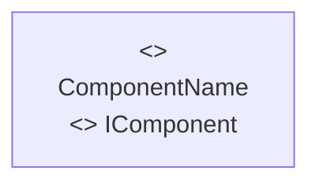

# Documentation Standards

This document defines the documentation standards for the Documentation Generator Plugin. All agents, commands, and skills should follow these guidelines when generating or formatting documentation.

## Table of Contents

- [Markdown Formatting Rules](#markdown-formatting-rules)
- [Code Example Standards](#code-example-standards)
- [Diagram Conventions](#diagram-conventions)
- [Link Formatting Guidelines](#link-formatting-guidelines)
- [Versioning Strategy](#versioning-strategy)
- [Multi-Language Support Guidelines](#multi-language-support-guidelines)

## Markdown Formatting Rules

### Markdownlint Compliance

All markdown files must comply with the following markdownlint rules:

#### MD001: Heading Levels Should Only Increment by One Level at a Time

**Correct:**
```markdown
# Heading 1
## Heading 2
### Heading 3
```

**Incorrect:**
```markdown
# Heading 1
### Heading 3 (skipped level 2)
```

#### MD003: Heading Style (ATX-style headers)

Use ATX-style headers (`#`) instead of Setext-style:

**Correct:**
```markdown
# Heading 1
## Heading 2
```

**Incorrect:**
```markdown
Heading 1
=========

Heading 2
---------
```

#### MD004: Unordered List Style

Use consistent list markers. Prefer `-` for unordered lists:

**Correct:**
```markdown
- Item 1
- Item 2
- Item 3
```

**Incorrect:**
```markdown
- Item 1
* Item 2
+ Item 3
```

#### MD007: Unordered List Indentation

Use 2 spaces for list indentation:

**Correct:**
```markdown
- Item 1
  - Nested item 1
  - Nested item 2
```

**Incorrect:**
```markdown
- Item 1
    - Nested item (4 spaces)
```

#### MD009: Trailing Spaces

Remove trailing spaces from lines.

#### MD012: Multiple Consecutive Blank Lines

Use only one blank line between sections:

**Correct:**
```markdown
## Section 1

Content here.

## Section 2
```

**Incorrect:**
```markdown
## Section 1

Content here.


## Section 2
```

#### MD022: Headings Should Be Surrounded by Blank Lines

**Correct:**
```markdown
Previous paragraph.

## Heading

Next paragraph.
```

**Incorrect:**
```markdown
Previous paragraph.
## Heading
Next paragraph.
```

#### MD040: Fenced Code Blocks Should Have a Language Specified

**Correct:**
````markdown
```javascript
const x = 1;
```
````

**Incorrect:**
````markdown
```
const x = 1;
```
````

#### MD047: Files Should End with a Single Newline Character

Ensure all files end with a newline.

### Heading Hierarchy

- Use only one `#` (H1) heading per file (typically the document title)
- Use `##` (H2) for main sections
- Use `###` (H3) for subsections
- Avoid going deeper than `####` (H4) when possible

### Lists

- Use `-` for unordered lists
- Use `1.` for ordered lists (markdown will auto-number)
- Indent nested lists with 2 spaces
- Add a blank line before and after lists

### Emphasis

- Use `**bold**` for important terms and UI elements
- Use `*italic*` for emphasis and variable names
- Use `` `code` `` for code references, filenames, and technical terms
- Use `***bold italic***` sparingly for critical information

### Tables

Format tables with proper alignment:

```markdown
| Column 1 | Column 2 | Column 3 |
|----------|----------|----------|
| Value 1  | Value 2  | Value 3  |
| Value 4  | Value 5  | Value 6  |
```

Alignment:
- Left-aligned: `|----------|`
- Center-aligned: `|:--------:|`
- Right-aligned: `|---------:|`

## Code Example Standards

### Language Specification

Always specify the language in fenced code blocks:

````markdown
```python
def hello():
    print("Hello, World!")
```
````

### Working Examples

- All code examples must be working, tested code
- Include expected output when relevant
- Show complete, runnable examples when possible
- Avoid pseudo-code unless explicitly noted

### Example Structure

For complex examples, follow this structure:

````markdown
### Example: User Authentication

**Scenario:** Authenticate a user with email and password

**Code:**
```javascript
const user = await authenticateUser({
  email: 'user@example.com',
  password: 'securePassword123'
});
```

**Expected Output:**
```json
{
  "id": "user_123",
  "email": "user@example.com",
  "token": "eyJhbGciOiJIUzI1NiIs..."
}
```

**Notes:**
- Token expires in 1 hour
- Use HTTPS for authentication requests
- Store token securely (not in localStorage)
```
````

### Error Handling Examples

Include error handling in examples when relevant:

```javascript
try {
  const data = await fetchData();
  console.log(data);
} catch (error) {
  console.error('Failed to fetch data:', error.message);
}
```

### Multi-Language Examples

When showing the same operation in multiple languages, use tabs or clear headings:

```markdown
**JavaScript:**
```javascript
const result = await doSomething();
```

**Python:**
```python
result = do_something()
```

**Go:**
```go
result, err := doSomething()
if err != nil {
    return err
}
```
```

### Code Comments

- Use comments to explain non-obvious code
- Avoid obvious comments ("increment x by 1")
- Explain the "why" not the "what"

## Diagram Conventions

### Mermaid Diagrams

All diagrams should use Mermaid syntax for consistency and renderability.

#### Diagram Types

**Flowchart:**


**Sequence Diagram:**


**Class Diagram:**


**Entity Relationship Diagram:**


#### Diagram Best Practices

- Keep diagrams simple and focused
- Use consistent naming conventions
- Label all relationships clearly
- Use color sparingly and meaningfully
- Include a caption explaining the diagram
- Place diagrams near relevant text

#### C4 Model Conventions

For C4 diagrams, use this annotation style:



Format: `Component Name<br/>Technology Stack`

#### UML Conventions

For UML diagrams, use stereotype annotations:



Format: `<<stereotype>><br/>Name<br/><<type>> Interface`

## Link Formatting Guidelines

### Internal Links

**Relative links to files:**
```markdown
[Architecture Documentation](./docs/architecture/README.md)
[API Reference](../api/endpoints.md)
```

**Anchor links within the same document:**
```markdown
[Installation](#installation)
[Usage Examples](#usage-examples)
```

**Rules:**
- Use relative paths for internal links
- Use lowercase and hyphens for anchor IDs
- Verify all internal links before committing
- Update links when moving or renaming files

### External Links

**Format:**
```markdown
[Link Text](https://example.com)
```

**Best Practices:**
- Use descriptive link text (not "click here")
- Check for broken links regularly
- Use HTTPS when available
- Include version numbers when linking to versioned docs:
  ```markdown
  [React v18 Documentation](https://react.dev/blog/2022/03/29/react-v18)
  ```

### Reference-Style Links

For frequently used links, use reference-style:

```markdown
Check out the [API documentation][api-docs] and [user guide][guide].

[api-docs]: ./docs/api/README.md
[guide]: ./docs/user-guide.md
```

### Image Links

```markdown

```

**Rules:**
- Always include descriptive alt text
- Use relative paths for images
- Optimize images for web (< 500KB)
- Use PNG for screenshots, JPEG for photos, SVG for diagrams

## Versioning Strategy

### Semantic Versioning

Follow [Semantic Versioning 2.0.0](https://semver.org/):

```
MAJOR.MINOR.PATCH
```

- **MAJOR**: Breaking changes (incompatible API changes)
- **MINOR**: New features (backward-compatible)
- **PATCH**: Bug fixes (backward-compatible)

### Version Documentation

**In package files:**
```json
{
  "version": "2.1.0"
}
```

**In documentation:**
```markdown
# Project Name v2.1.0

> Documentation for version 2.1.0
```

**In code examples:**
```bash
npm install package-name@2.1.0
```

### Changelog Format

Follow [Keep a Changelog](https://keepachangelog.com/):

```markdown
# Changelog

## [Unreleased]

### Added
- New feature description

### Changed
- Changed feature description

### Deprecated
- Deprecated feature description

### Removed
- Removed feature description

### Fixed
- Bug fix description

### Security
- Security fix description

## [2.1.0] - 2024-11-16

### Added
- Feature X for improved performance
- Support for new API endpoint

### Fixed
- Bug #123: Fixed authentication issue

[Unreleased]: https://github.com/user/repo/compare/v2.1.0...HEAD
[2.1.0]: https://github.com/user/repo/compare/v2.0.0...v2.1.0
```

### API Versioning

Document API versions clearly:

```markdown
## API v2

Base URL: `https://api.example.com/v2`

### Breaking Changes from v1

- Endpoint `/users` renamed to `/accounts`
- Authentication now requires Bearer token instead of API key
- Response format changed from XML to JSON
```

## Multi-Language Support Guidelines

### Inline Code Documentation

#### Python (Google-style docstrings)

```python
def authenticate_user(email: str, password: str) -> dict:
    """Authenticate a user with email and password.

    Args:
        email (str): User's email address
        password (str): User's password

    Returns:
        dict: User object with id, email, and token

    Raises:
        AuthenticationError: If credentials are invalid
        ValueError: If email format is invalid

    Example:
        >>> user = authenticate_user('user@example.com', 'password123')
        >>> print(user['email'])
        user@example.com
    """
    pass
```

#### JavaScript/TypeScript (JSDoc)

```javascript
/**
 * Authenticate a user with email and password.
 *
 * @param {string} email - User's email address
 * @param {string} password - User's password
 * @returns {Promise<Object>} User object with id, email, and token
 * @throws {AuthenticationError} If credentials are invalid
 *
 * @example
 * const user = await authenticateUser('user@example.com', 'password123');
 * console.log(user.email); // 'user@example.com'
 */
async function authenticateUser(email, password) {
  // Implementation
}
```

#### Go (Go doc comments)

```go
// AuthenticateUser authenticates a user with email and password.
//
// Parameters:
//   - email: User's email address
//   - password: User's password
//
// Returns:
//   - *User: User object with ID, Email, and Token
//   - error: AuthenticationError if credentials are invalid
//
// Example:
//
//	user, err := AuthenticateUser("user@example.com", "password123")
//	if err != nil {
//	    return err
//	}
//	fmt.Println(user.Email) // "user@example.com"
func AuthenticateUser(email, password string) (*User, error) {
    // Implementation
}
```

#### Java (Javadoc)

```java
/**
 * Authenticates a user with email and password.
 *
 * @param email User's email address
 * @param password User's password
 * @return User object with id, email, and token
 * @throws AuthenticationException if credentials are invalid
 * @throws IllegalArgumentException if email format is invalid
 *
 * @example
 * <pre>
 * User user = authenticateUser("user@example.com", "password123");
 * System.out.println(user.getEmail()); // "user@example.com"
 * </pre>
 */
public User authenticateUser(String email, String password)
    throws AuthenticationException {
    // Implementation
}
```

#### Rust (Rustdoc)

```rust
/// Authenticates a user with email and password.
///
/// # Arguments
///
/// * `email` - User's email address
/// * `password` - User's password
///
/// # Returns
///
/// * `Result<User, AuthError>` - User object or authentication error
///
/// # Errors
///
/// Returns `AuthError::InvalidCredentials` if credentials are invalid
///
/// # Examples
///
/// ```
/// let user = authenticate_user("user@example.com", "password123")?;
/// println!("{}", user.email); // "user@example.com"
/// ```
pub fn authenticate_user(email: &str, password: &str) -> Result<User, AuthError> {
    // Implementation
}
```

#### C# (XML documentation)

```csharp
/// <summary>
/// Authenticates a user with email and password.
/// </summary>
/// <param name="email">User's email address</param>
/// <param name="password">User's password</param>
/// <returns>User object with Id, Email, and Token</returns>
/// <exception cref="AuthenticationException">
/// Thrown when credentials are invalid
/// </exception>
/// <example>
/// <code>
/// var user = await AuthenticateUser("user@example.com", "password123");
/// Console.WriteLine(user.Email); // "user@example.com"
/// </code>
/// </example>
public async Task<User> AuthenticateUser(string email, string password) {
    // Implementation
}
```

#### Ruby (RDoc/YARD)

```ruby
# Authenticates a user with email and password.
#
# @param email [String] User's email address
# @param password [String] User's password
# @return [Hash] User object with id, email, and token
# @raise [AuthenticationError] if credentials are invalid
#
# @example
#   user = authenticate_user('user@example.com', 'password123')
#   puts user[:email] # => "user@example.com"
def authenticate_user(email, password)
  # Implementation
end
```

#### PHP (PHPDoc)

```php
/**
 * Authenticates a user with email and password.
 *
 * @param string $email User's email address
 * @param string $password User's password
 * @return array User object with id, email, and token
 * @throws AuthenticationException if credentials are invalid
 *
 * @example
 * $user = authenticateUser('user@example.com', 'password123');
 * echo $user['email']; // "user@example.com"
 */
function authenticateUser($email, $password) {
    // Implementation
}
```

### Documentation File Naming

Use consistent naming conventions:

- **README files**: `README.md` (uppercase)
- **Changelog**: `CHANGELOG.md` (uppercase)
- **Contributing**: `CONTRIBUTING.md` (uppercase)
- **License**: `LICENSE` or `LICENSE.md` (uppercase)
- **Documentation files**: `kebab-case.md` (lowercase with hyphens)
  - Examples: `getting-started.md`, `api-reference.md`, `architecture-overview.md`

### Language-Specific Documentation

When documenting multi-language projects:

```
docs/
├── README.md                    # Overview and links
├── javascript/
│   ├── README.md               # JavaScript-specific guide
│   ├── api-reference.md
│   └── examples.md
├── python/
│   ├── README.md               # Python-specific guide
│   ├── api-reference.md
│   └── examples.md
└── go/
    ├── README.md               # Go-specific guide
    ├── api-reference.md
    └── examples.md
```

## Accessibility Standards

### Alt Text for Images

- Provide descriptive alt text for all images
- Describe the content and purpose, not just "image" or "screenshot"
- Keep alt text concise (< 125 characters when possible)

**Good:**
```markdown

```

**Bad:**
```markdown

```

### Color Usage

- Don't rely solely on color to convey information
- Ensure sufficient contrast ratios (WCAG AA: 4.5:1 for normal text)
- Use text labels in addition to color coding

### Heading Structure

- Use headings hierarchically (don't skip levels)
- Headings should describe the content that follows
- Use meaningful heading text (not just "Details" or "More")

## Best Practices Summary

### Do's

✅ Use consistent formatting throughout
✅ Test all code examples before publishing
✅ Include working, complete examples
✅ Provide clear, descriptive headings
✅ Use diagrams to clarify complex concepts
✅ Keep paragraphs short and scannable
✅ Update documentation with code changes
✅ Validate all links regularly
✅ Use relative links for internal references
✅ Follow semantic versioning

### Don'ts

❌ Skip heading levels
❌ Use Setext-style headers
❌ Mix list markers (-, *, +)
❌ Leave trailing spaces
❌ Forget language specifiers in code blocks
❌ Use multiple consecutive blank lines
❌ Skip blank lines around headings
❌ Use "click here" for link text
❌ Include broken links
❌ Use absolute paths for internal links

## Tools and Validation

### Recommended Tools

- **Markdown Linting**: markdownlint, remark-lint
- **Link Checking**: markdown-link-check, linkinator
- **Spelling**: cspell, aspell
- **Formatting**: Prettier with markdown plugin

### Pre-commit Checks

Run these checks before committing documentation:

```bash
# Lint markdown files
markdownlint '**/*.md'

# Check links
markdown-link-check '**/*.md'

# Spell check
cspell '**/*.md'

# Format markdown
prettier --write '**/*.md'
```

## Version History

- **1.0.0** (2024-11-16): Initial documentation standards
