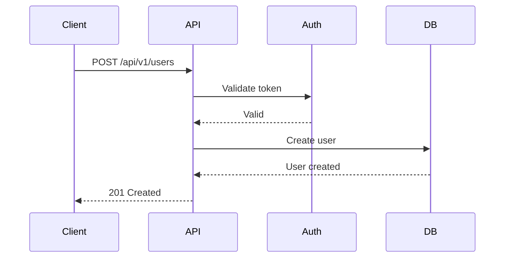

# Generate API Documentation

Generate API documentation for: $ARGUMENTS

## Arguments

- **api-type** (optional): `rest`, `graphql`, `grpc`, or `all` (default: auto-detect)
- **framework** (optional): `express`, `fastapi`, `gin`, etc., or `auto` (default)

## Examples

- `/api-docs` - Auto-detect API type and framework
- `/api-docs rest` - REST API only
- `/api-docs graphql fastapi` - GraphQL with FastAPI
- `/api-docs grpc` - gRPC API only

## Task

You are tasked with generating comprehensive API documentation tailored to the specified API type and framework.

### Argument Parsing

Parse $ARGUMENTS to extract:
1. **API type** (first argument) - defaults to auto-detect if not provided
2. **Framework** (second argument) - defaults to `auto` if not provided

### API Types

- **rest**: REST API with HTTP methods (GET, POST, PUT, DELETE, PATCH)
- **graphql**: GraphQL API with queries, mutations, subscriptions
- **grpc**: gRPC API with Protocol Buffers
- **all**: Document all detected API types

## Analysis Steps

1. **Detect API Type**:
   - REST API (Express, FastAPI, etc.)
   - GraphQL API
   - gRPC API
   - Multiple types

2. **Extract API Endpoints/Operations**:
   - Parse route definitions
   - Identify HTTP methods
   - Extract path parameters
   - Find query parameters
   - Identify request/response schemas

3. **Analyze Authentication**:
   - Authentication mechanism (JWT, OAuth, API key, etc.)
   - Authorization rules
   - Required scopes or permissions

4. **Identify Error Handling**:
   - Error response formats
   - HTTP status codes used
   - Error code enumeration

## REST API Documentation

For REST APIs, document each endpoint with:

### Endpoint Structure

```markdown
## [Method] /api/v1/resource/{id}

Brief description of what this endpoint does.

### Authentication
- **Required**: Yes/No
- **Type**: Bearer token, API key, etc.
- **Scopes**: `read:resource`, `write:resource`

### Path Parameters
| Parameter | Type   | Required | Description        |
|-----------|--------|----------|--------------------|
| id        | string | Yes      | Resource identifier |

### Query Parameters
| Parameter | Type   | Required | Description           |
|-----------|--------|----------|-----------------------|
| limit     | number | No       | Max items to return   |
| offset    | number | No       | Pagination offset     |
| sort      | string | No       | Sort field and order  |

### Request Headers
| Header         | Required | Description              |
|----------------|----------|--------------------------|
| Authorization  | Yes      | Bearer {token}           |
| Content-Type   | Yes      | application/json         |

### Request Body
\`\`\`json
{
  "name": "string",
  "email": "string",
  "age": 0
}
\`\`\`

### Success Response (200 OK)
\`\`\`json
{
  "id": "string",
  "name": "string",
  "email": "string",
  "age": 0,
  "created_at": "2024-01-01T00:00:00Z"
}
\`\`\`

### Error Responses

#### 400 Bad Request
\`\`\`json
{
  "error": "validation_error",
  "message": "Invalid email format",
  "details": [
    {
      "field": "email",
      "message": "Must be valid email"
    }
  ]
}
\`\`\`

#### 401 Unauthorized
\`\`\`json
{
  "error": "unauthorized",
  "message": "Invalid or expired token"
}
\`\`\`

#### 404 Not Found
\`\`\`json
{
  "error": "not_found",
  "message": "Resource not found"
}
\`\`\`

#### 500 Internal Server Error
\`\`\`json
{
  "error": "internal_error",
  "message": "An unexpected error occurred"
}
\`\`\`

### Rate Limiting
- **Limit**: 100 requests per minute
- **Headers**: X-RateLimit-Limit, X-RateLimit-Remaining, X-RateLimit-Reset

### Example
\`\`\`bash
curl -X POST https://api.example.com/api/v1/users \\
  -H "Authorization: Bearer your-token" \\
  -H "Content-Type: application/json" \\
  -d '{
    "name": "John Doe",
    "email": "john@example.com",
    "age": 30
  }'
\`\`\`
```

## GraphQL API Documentation

For GraphQL APIs, document:

### Schema Documentation

```markdown
## Types

### User
\`\`\`graphql
type User {
  id: ID!
  name: String!
  email: String!
  age: Int
  posts: [Post!]!
  createdAt: DateTime!
}
\`\`\`

## Queries

### getUser
Fetch a single user by ID.

\`\`\`graphql
query getUser($id: ID!) {
  user(id: $id) {
    id
    name
    email
  }
}
\`\`\`

**Arguments:**
- `id` (ID!, required): User identifier

**Returns:** User or null

## Mutations

### createUser
Create a new user.

\`\`\`graphql
mutation createUser($input: CreateUserInput!) {
  createUser(input: $input) {
    id
    name
    email
  }
}
\`\`\`

**Arguments:**
- `input` (CreateUserInput!, required): User creation data

**Returns:** User

### Input Types

\`\`\`graphql
input CreateUserInput {
  name: String!
  email: String!
  age: Int
}
\`\`\`
```

## gRPC API Documentation

For gRPC APIs, document:

```markdown
## Service: UserService

### GetUser
Retrieve a user by ID.

**Request:**
\`\`\`protobuf
message GetUserRequest {
  string user_id = 1;
}
\`\`\`

**Response:**
\`\`\`protobuf
message User {
  string id = 1;
  string name = 2;
  string email = 3;
  int32 age = 4;
}
\`\`\`

**Errors:**
- `NOT_FOUND`: User not found
- `INVALID_ARGUMENT`: Invalid user ID

### CreateUser
Create a new user.

**Request:**
\`\`\`protobuf
message CreateUserRequest {
  string name = 1;
  string email = 2;
  int32 age = 3;
}
\`\`\`

**Response:**
\`\`\`protobuf
message User {
  string id = 1;
  string name = 2;
  string email = 3;
  int32 age = 4;
}
\`\`\`
```

## Generate OpenAPI Specification

For REST APIs, generate OpenAPI 3.0 spec:

1. Analyze route definitions
2. Extract schemas from validation/serialization
3. Generate OpenAPI YAML/JSON
4. Include all endpoints, parameters, responses
5. Add examples and descriptions

Save as `openapi.yaml` or `openapi.json`

## Generate Postman Collection

Create a Postman collection with:
- All endpoints
- Example requests
- Environment variables
- Tests/assertions

Save as `postman_collection.json`

## Documentation Structure

Create or update these files:

1. **docs/api/README.md** - API overview and getting started
2. **docs/api/authentication.md** - Authentication guide
3. **docs/api/endpoints.md** - All endpoint documentation (REST)
4. **docs/api/schema.md** - GraphQL schema (if applicable)
5. **docs/api/errors.md** - Error codes and handling
6. **docs/api/rate-limiting.md** - Rate limiting details
7. **docs/api/changelog.md** - API version changelog
8. **openapi.yaml** - OpenAPI specification (REST)
9. **postman_collection.json** - Postman collection

## Use Mermaid for API Flows

Use **Mermaid Chart MCP** to create sequence diagrams for:
- Authentication flow
- Complex API interactions
- Error handling flows
- Webhook flows

Example:


## Best Practices

Follow `DOCUMENTATION_STANDARDS.md`:

- Include working examples
- Document all parameters
- Show all possible responses
- Include error scenarios
- Keep examples up-to-date
- Version API documentation
- Use consistent formatting
- Add request/response schemas

## Review Checklist

- [ ] All endpoints documented
- [ ] Authentication explained
- [ ] Request/response schemas complete
- [ ] Error responses documented
- [ ] Examples are working
- [ ] Rate limiting documented
- [ ] OpenAPI spec generated (if REST)
- [ ] Postman collection created
- [ ] API flows diagrammed

Generate comprehensive API documentation with examples and specifications.
