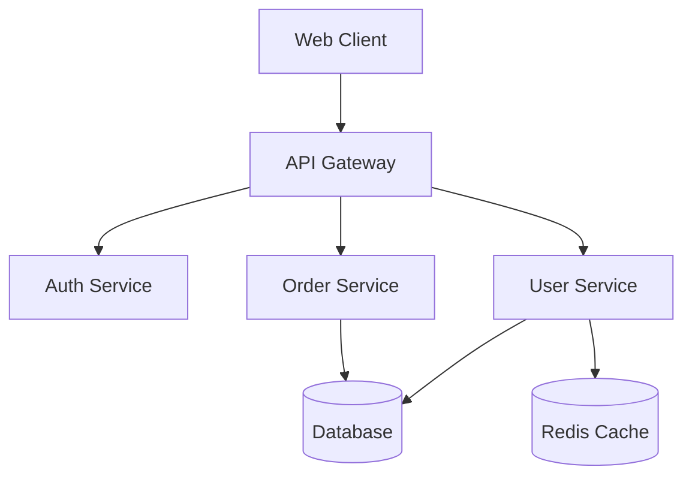
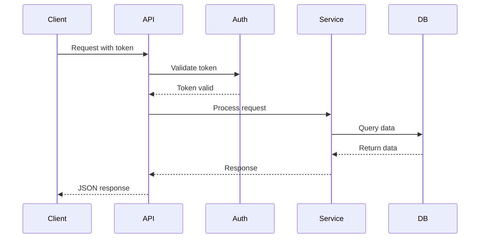
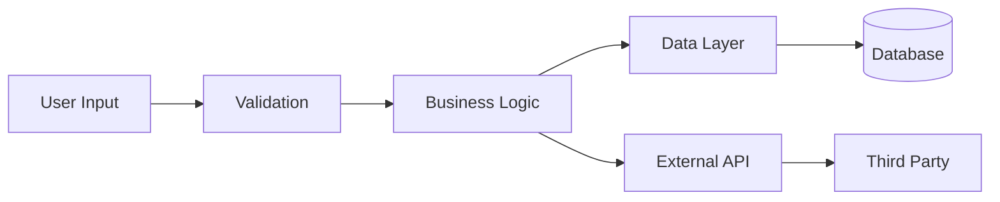
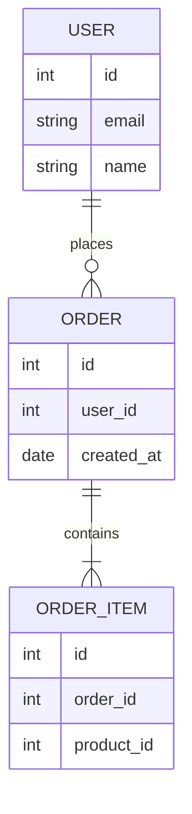

# Generate Architecture Documentation

Generate architecture documentation for: $ARGUMENTS

## Arguments

- **focus** (optional): `overview`, `components`, `data`, `security`, `infrastructure`, or `all` (default)
- **style** (optional): `c4`, `uml`, or `simple` (default)

## Examples

- `/arch-doc` - Complete architecture docs (all areas, simple style)
- `/arch-doc security` - Security architecture only
- `/arch-doc components c4` - Components using C4 model
- `/arch-doc data` - Data architecture only

## Task

You are tasked with generating comprehensive architecture documentation tailored to the specified focus area and architectural style.

### Argument Parsing

Parse $ARGUMENTS to extract:
1. **Focus area** (first argument) - defaults to `all` if not provided
2. **Style** (second argument) - defaults to `simple` if not provided

### Focus Areas

- **overview**: High-level system context and technology stack
- **components**: Detailed component documentation and relationships
- **data**: Data models, flows, and storage architecture
- **security**: Security architecture, authentication, authorization
- **infrastructure**: Deployment, containerization, CI/CD
- **all**: Complete documentation covering all areas

## Analysis Steps

1. **Analyze Codebase Structure**:
   - Identify major components and modules
   - Analyze dependencies and relationships
   - Detect architectural patterns (MVC, microservices, layered, etc.)
   - Identify data flow and communication patterns
   - Map external dependencies and integrations

2. **Identify Technology Stack**:
   - Programming languages
   - Frameworks and libraries
   - Databases and data stores
   - Infrastructure components
   - Third-party services

3. **Understand System Boundaries**:
   - Entry points (API, CLI, UI)
   - External integrations
   - Database connections
   - Message queues or event streams
   - Caching layers

## Documentation Components

### 1. System Overview

Create a high-level overview including:
- System purpose and goals
- Key architectural decisions
- Technology stack summary
- Deployment environment (cloud, on-premise, hybrid)

### 2. Architecture Diagrams

Use **Mermaid Chart MCP** to generate diagrams:

#### Component Diagram
Show major system components and their relationships:

#### Sequence Diagrams
Document key flows and interactions:

#### Data Flow Diagrams
Show how data moves through the system:

#### Entity-Relationship Diagrams
Document data models and relationships:

### 3. Architecture Decision Records (ADRs)

Create ADRs for significant architectural decisions using the template in `templates/ADR-template.md`:

- Why was this technology chosen?
- What alternatives were considered?
- What are the trade-offs?
- What are the consequences?

Example ADR topics:
- Choice of database (SQL vs NoSQL)
- Microservices vs Monolith
- REST vs GraphQL vs gRPC
- Synchronous vs Asynchronous communication
- Authentication/authorization approach
- Caching strategy
- Deployment strategy

### 4. Component Documentation

For each major component, document:

**Purpose**: What this component does
**Responsibilities**: Key responsibilities
**Dependencies**: What it depends on
**Interfaces**: APIs it exposes
**Data**: Data it manages
**Configuration**: Configuration options

### 5. Data Architecture

Document:
- Database schema
- Data models and relationships
- Data flow and transformations
- Caching strategy
- Data retention policies
- Backup and recovery

### 6. Infrastructure Architecture

Document:
- Deployment architecture
- Containerization (Docker)
- Orchestration (Kubernetes)
- CI/CD pipeline
- Monitoring and logging
- Scaling strategy

### 7. Security Architecture

Document:
- Authentication mechanism
- Authorization model
- Data encryption (at rest, in transit)
- Security boundaries
- Secrets management
- Compliance requirements

### 8. Integration Architecture

Document:
- External APIs and services
- Message queues and event streams
- Webhooks
- Third-party integrations
- API versioning strategy

## Output Structure

Create or update these files:

1. **docs/architecture/README.md** - Main architecture document
2. **docs/architecture/components.md** - Component details
3. **docs/architecture/data-architecture.md** - Data models and flow
4. **docs/architecture/infrastructure.md** - Deployment and infrastructure
5. **docs/architecture/decisions/** - ADR directory with individual ADR files

## Use Mermaid Chart MCP

For all diagrams, leverage the **Mermaid Chart MCP** to:
- Generate component diagrams
- Create sequence diagrams for API flows
- Build ER diagrams for data models
- Create flowcharts for business logic
- Generate state diagrams if applicable

## Best Practices

Follow standards from `DOCUMENTATION_STANDARDS.md`:

- Keep diagrams simple and focused
- Use consistent naming conventions
- Document the "why" not just the "what"
- Include both high-level and detailed views
- Keep documentation synchronized with code
- Version architecture docs with code
- Review and update regularly

## Review Checklist

- [ ] System overview is clear and complete
- [ ] All major components are documented
- [ ] Diagrams are accurate and up-to-date
- [ ] ADRs capture key decisions
- [ ] Data flow is clearly illustrated
- [ ] Security considerations are documented
- [ ] Integration points are identified
- [ ] Infrastructure is documented

Generate comprehensive architecture documentation with diagrams using Mermaid.
