# Mermaid Diagram Examples and Templates

This file contains templates and examples for common Mermaid diagram types used in architecture documentation.

## Table of Contents

- [Flowchart](#flowchart)
- [Sequence Diagram](#sequence-diagram)
- [Class Diagram](#class-diagram)
- [State Diagram](#state-diagram)
- [Entity Relationship Diagram](#entity-relationship-diagram)
- [Gantt Chart](#gantt-chart)
- [Git Graph](#git-graph)
- [System Architecture](#system-architecture)

## Flowchart

### Simple Flowchart

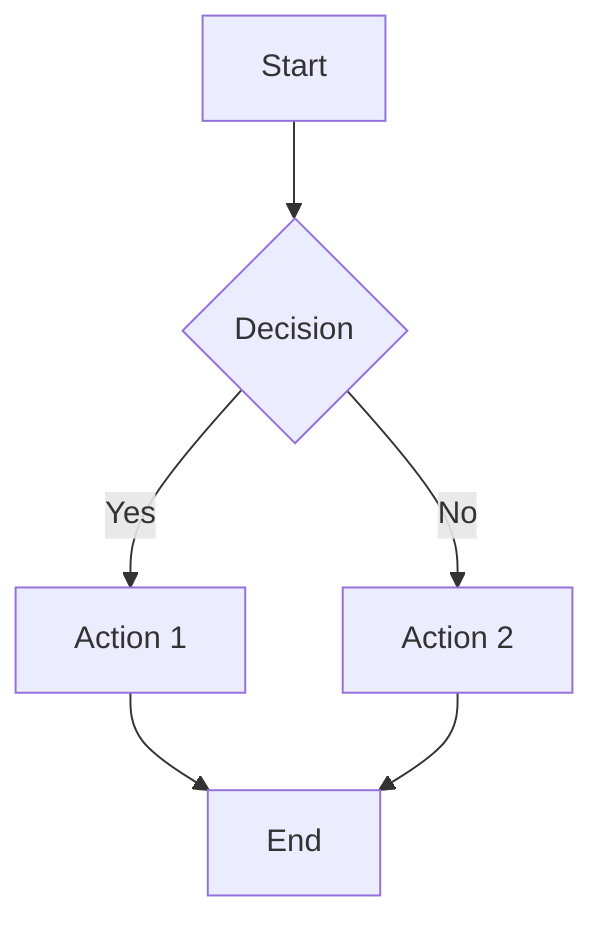

### Complex Flowchart with Subgraphs

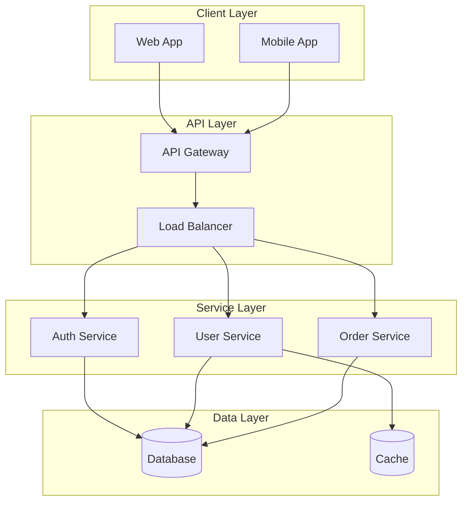

### Process Flow

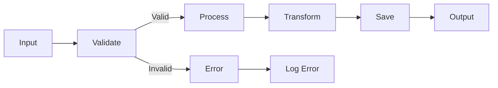

## Sequence Diagram

### API Request Flow

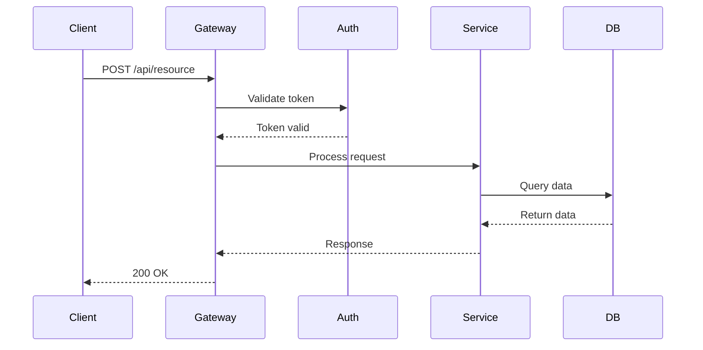

### Authentication Flow

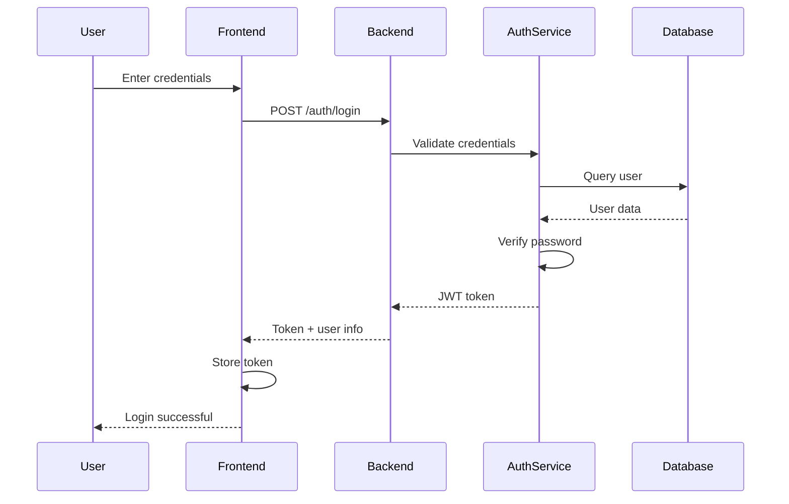

### Error Handling Flow

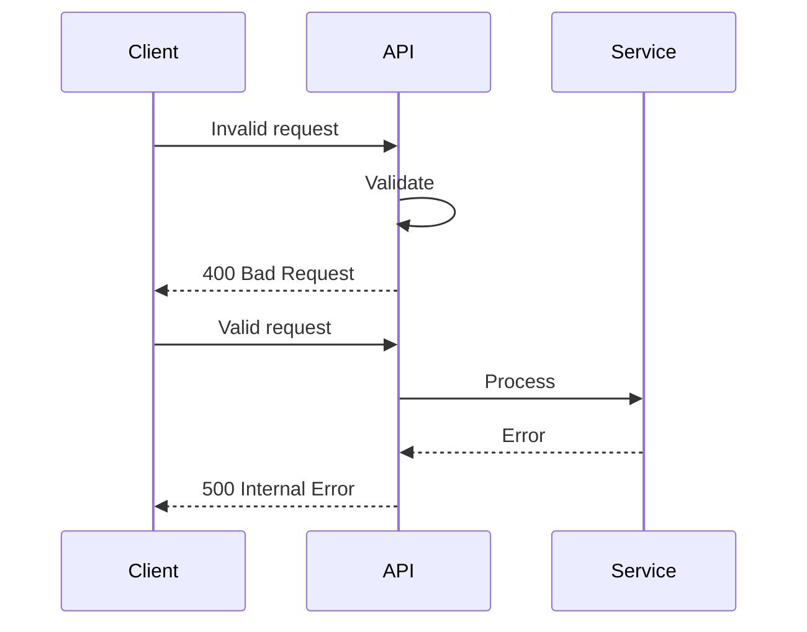

## Class Diagram

### Object-Oriented Design

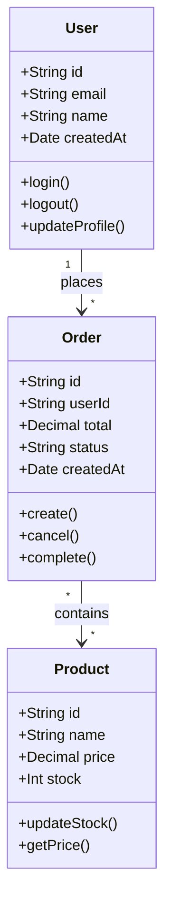

### Service Architecture

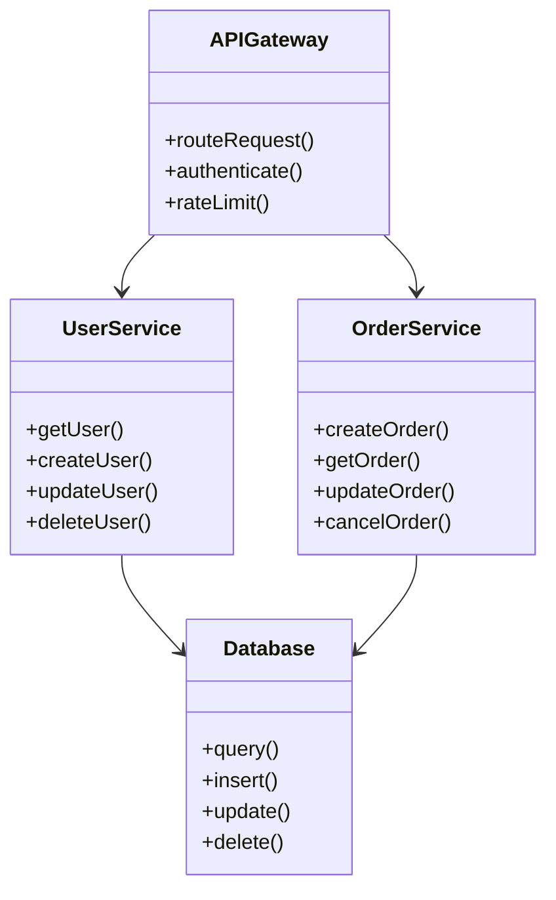

## State Diagram

### Order State Machine

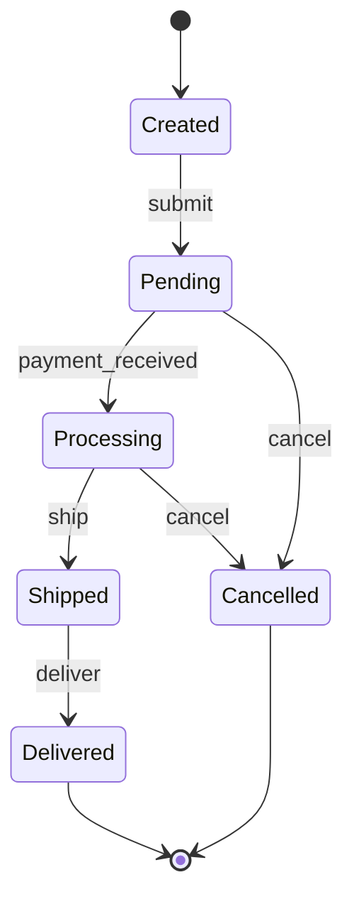

### User Authentication States

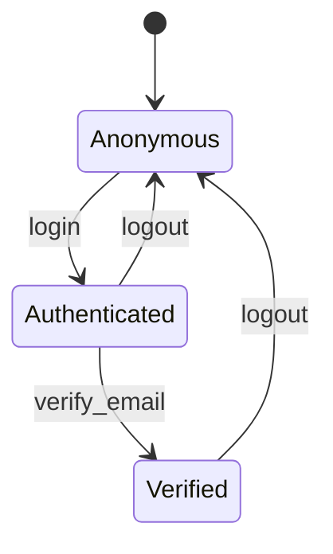

## Entity Relationship Diagram

### E-Commerce Database

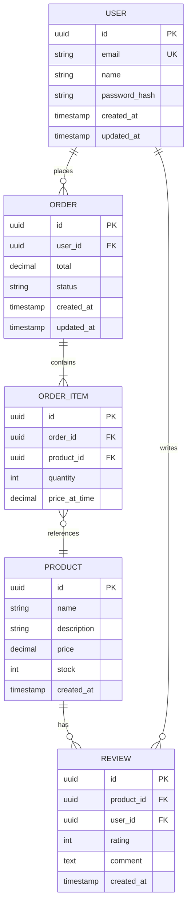

### Simple Relationships

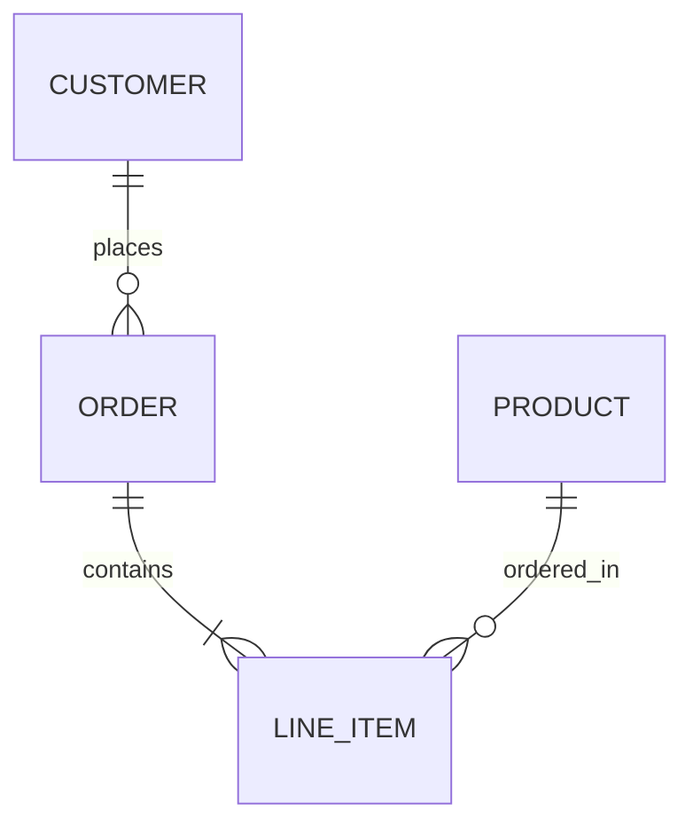

## Gantt Chart

### Project Timeline

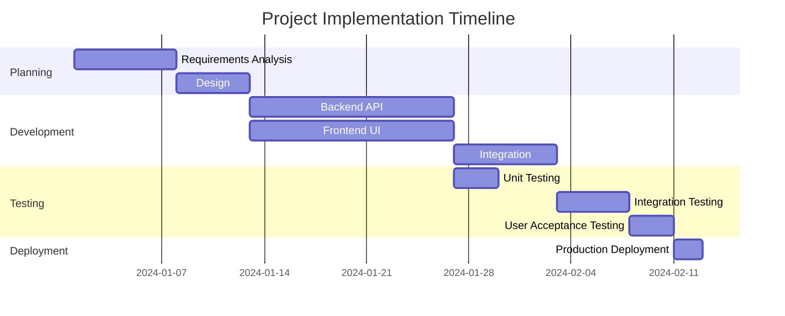

## Git Graph

### Branch Strategy

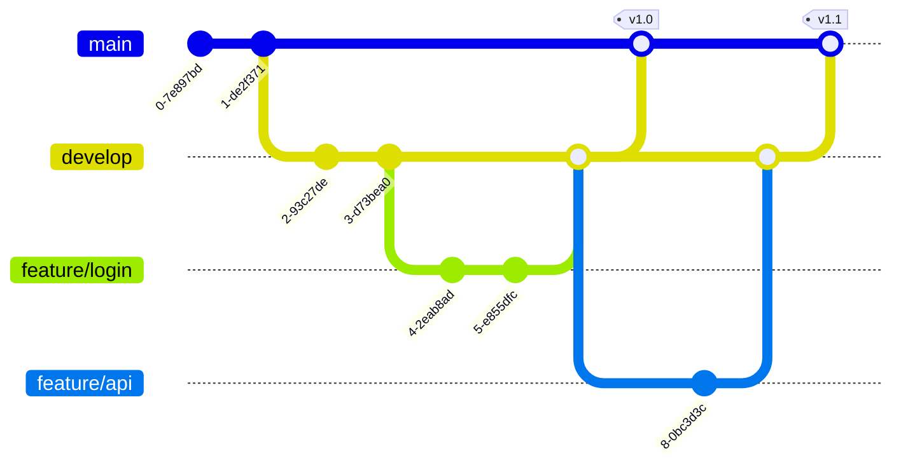

## System Architecture

### Microservices Architecture

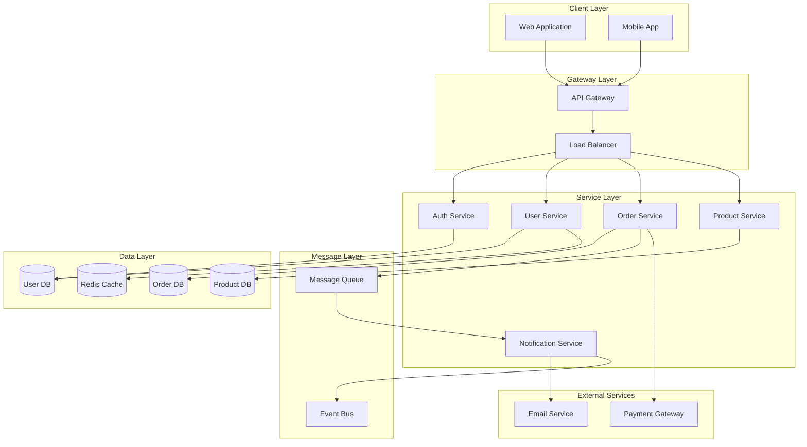

### Deployment Architecture

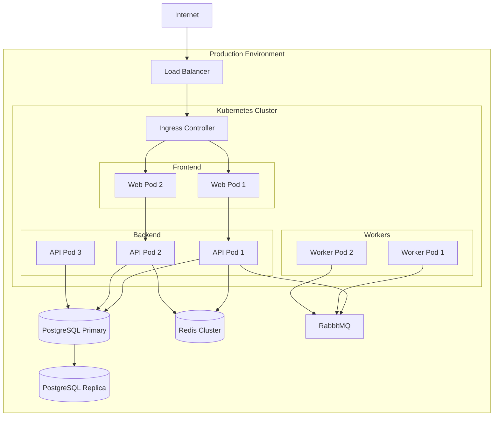

## Tips for Creating Diagrams

### Best Practices

1. **Keep it Simple**: Don't overcomplicate diagrams
2. **Use Subgraphs**: Group related components
3. **Consistent Naming**: Use clear, descriptive names
4. **Direction**: Choose appropriate direction (TB, LR, etc.)
5. **Colors**: Use colors sparingly for emphasis
6. **Labels**: Add labels to clarify relationships

### Common Patterns

**For APIs:**
- Use sequence diagrams for request flows
- Use flowcharts for decision logic
- Use class diagrams for data models

**For Architecture:**
- Use component diagrams for system overview
- Use deployment diagrams for infrastructure
- Use sequence diagrams for interactions

**For Data:**
- Use ER diagrams for database schema
- Use state diagrams for entity lifecycles
- Use flowcharts for data transformations

### Resources

- [Mermaid Documentation](https://mermaid.js.org/)
- [Mermaid Live Editor](https://mermaid.live/)
- [Mermaid Chart](https://www.mermaidchart.com/)
